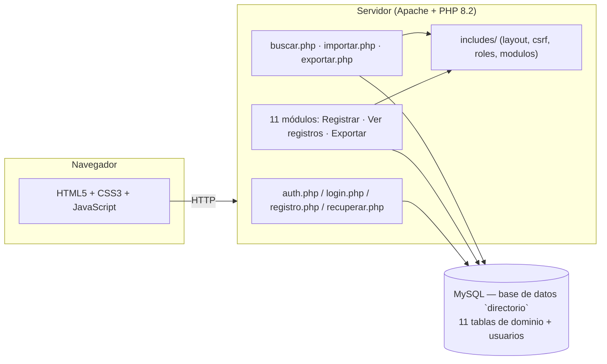

# SIRAD — Sistema de Registro y Administración de Directorios

Aplicación web para centralizar el directorio institucional de la **Fundación Rafael Pombo**: once módulos (instituciones educativas, practicantes, artistas, talleristas, editoriales, asocajas, mercadeo, proveedores, medios, team y directivos), con registro, edición, consulta, eliminación, búsqueda global, importación masiva y exportación a Excel.

Proyecto de grado (Ingeniería de Sistemas, UNIMINUTO). Uso restringido al contexto académico y de la Fundación — no tiene licencia de código abierto.

## Funcionalidades

- **Autenticación**: registro e inicio de sesión con contraseñas encriptadas (`password_hash`), bloqueo temporal tras 5 intentos fallidos, y recuperación de contraseña mediante pregunta de seguridad.
- **Roles**: el primer usuario registrado queda como **administrador** automáticamente; el resto se crea como **usuario**. Editar, eliminar y exportar a Excel están restringidos a administradores; registrar y consultar están disponibles para cualquier usuario autenticado.
- **CRUD por módulo**: cada uno de los once módulos tiene su propio formulario de registro/edición y su vista de consulta, con búsqueda y paginación del lado del cliente.
- **Búsqueda global** (`buscar.php`): busca un término en los once módulos a la vez.
- **Importación masiva** (`importar.php`): carga registros desde un CSV, con plantilla descargable por módulo y detección de correos duplicados.
- **Exportación a Excel** (`exportar.php`): descarga los registros de un módulo filtrados por rango de fechas.
- **Auditoría**: cada registro guarda quién lo creó y quién lo modificó por última vez (`creado_por`, `actualizado_por`, `actualizado_en`).
- **Seguridad**: sentencias preparadas (mysqli) en toda consulta con datos de usuario, salida escapada con `htmlspecialchars`, tokens CSRF en los formularios POST, y una lista blanca de módulos/tablas para exportar, buscar e importar.

## Arquitectura



## Stack

- **Backend**: PHP 8.2 (mysqli, sentencias preparadas)
- **Base de datos**: MySQL / MariaDB (esquema versionado en [`db/schema.sql`](db/schema.sql))
- **Frontend**: HTML5, CSS3 (sin frameworks), JavaScript con la Web Animations API
- **Entorno local**: XAMPP (Apache + PHP + MySQL)

## Estructura del proyecto

```
proyecto/
├── includes/          # layout.php, csrf.php, roles.php, modulos.php (compartidos)
├── css/, js/           # estilos y animaciones
├── db/                 # schema.sql y backup.php (respaldo por CLI)
├── {modulo}.php             # Registrar / editar
├── {modulo}_registros.php   # Ver registros
├── {modulo}_exportar.php    # Descargar Excel (solo admin)
├── login.php, registro.php, recuperar.php, logout.php
├── buscar.php, importar.php, exportar.php
└── index.php            # Panel principal
```

## Instalación local (XAMPP)

1. Copia la carpeta del proyecto a `C:\xampp\htdocs\`.
2. Crea la base de datos e importa el esquema:
   ```bash
   mysql -u root < db/schema.sql
   ```
3. Revisa las credenciales en [`config.php`](config.php) (por defecto: `root` sin contraseña, como en una instalación XAMPP estándar).
4. Inicia Apache y MySQL desde el panel de XAMPP.
5. Abre `http://localhost/proyecto/registro.php` y crea la primera cuenta — quedará como administrador automáticamente.

## Respaldo de la base de datos

```bash
php db/backup.php
```

Genera un `.sql` con estructura y datos en `db/backups/` (no se expone por HTTP).
